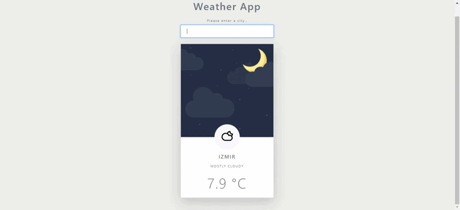
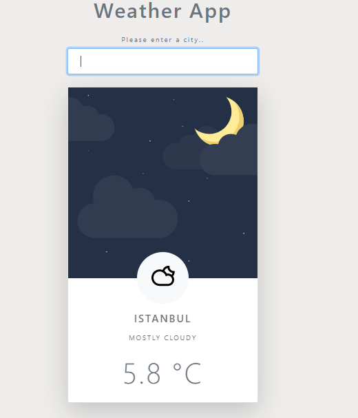

## Project: Wheather App

## Animation of the App

## Visulation of the App

## Description
When user searches a city in the world, project displays current wheather information via AccuWeather API key.

## Project Skeleton

|----Weather App

        |----index.html
        |----styles.css
        |----scripts.js
        |----weather-app.gif
        |----weather-app.png
        |----img
        |----readme.md
## Overview
I mastered HTML, CSS and Javascript features in this project. You can see the visual representation of the Wheather App above.

🔥 You can use [AccuWeather Api](https://developer.accuweather.com//) for your app.

